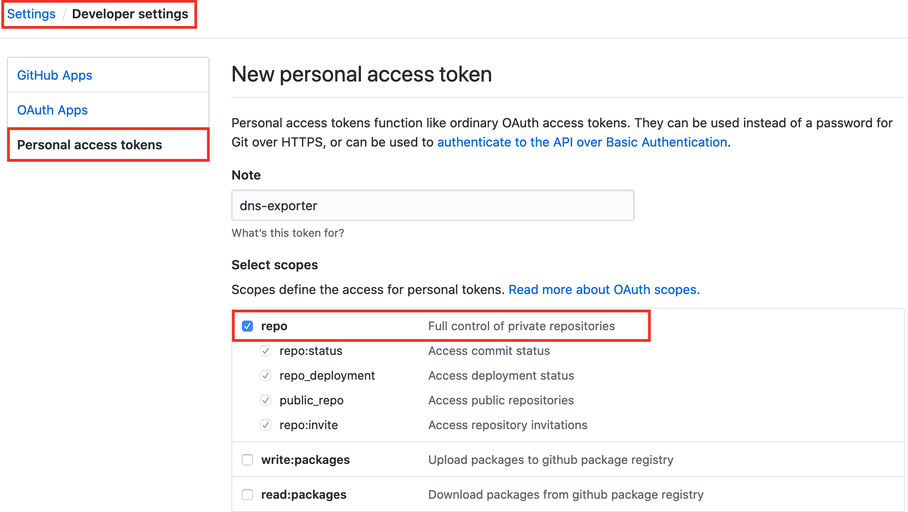

# GitHub
You will have to provide a token with a permission to clone/pull/push to Private Repository:


# Route53
Required IAM Policy:
```json
{
    "Version": "2012-10-17",
    "Statement": [
        {
            "Sid": "VisualEditor0",
            "Effect": "Allow",
            "Action": [
                "route53:ListHostedZones",
                "route53:ListResourceRecordSets"
            ],
            "Resource": "*"
        }
    ]
}
```